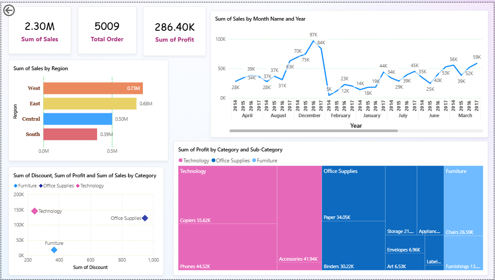

# 📊 Sales Data Analysis using Power BI

An end-to-end data analytics project analyzing the **Sample Superstore Dataset** using **Power BI**.  
This project uncovers insights on **sales trends, regional performance, category profitability, and discount impacts** to enable better business decision-making.  

---

## 🔹 Problem Statement
Businesses often struggle to identify which regions, categories, and customers drive profits.  
This project analyzes Superstore sales data and builds an **interactive Power BI dashboard** to:  
- Visualize key sales metrics  
- Reveal customer behavior patterns  
- Empower data-driven strategic choices  

---

## 🔹 Dataset
- **Source**: Sample Superstore dataset  
- **Size**: ~10,000 rows, 20+ columns  
- **Key Columns**: Order ID, Order Date, Ship Mode, Customer, Sales, Profit, Region, Category, Sub-Category, Discount  

---

## 🔹 Tools Used
- Excel → Initial data review  
- Power BI → Data cleaning, modeling, dashboarding  

---

## 🔹 Dashboard Snapshot

---

## 🔹 Key Insights
1. **Regional Performance**
   - West region has the highest sales (0.73M).  
   - South region contributes the least (0.39M).  

2. **Category-Level Insights**
   - Technology is the most profitable category, especially Copiers (55.6K) and Phones (44.5K).  
   - Furniture has the lowest profit despite high sales, mainly due to higher discounts.  
   - Office Supplies generates steady profit with items like Paper (34K) and Binders (30K).  

3. **Sales Trend**
   - Sales grew steadily from 2014 to 2017, peaking at 97K in Dec 2017.  
   - Seasonal spikes show higher sales during year-end months (Nov–Dec).  

4. **Discount Impact**
   - Higher discounts in Furniture reduce profitability.  
   - Technology gives better profit even with moderate discounts.  

---

## 🔹 Recommendations
1. Focus on **Technology products** in marketing & promotions (highest profit margins).  
2. **Optimize Furniture discounts** to avoid unnecessary profit losses.  
3. **Region-specific strategy**:  
   - Expand efforts in South region (low sales).  
   - Leverage West region for cross-selling.  
4. Plan **seasonal promotions** around Nov–Dec to maximize revenue.  

---

## 🔹 Project Structure
Sales-Data-Analysis-PowerBI/
│
├── data/
│ └── Sample-Superstore.csv
│
├── docs/
│ ├── Insights-and-Recommendations.docx
│ ├── Superstore-Analysis-Dashboard.pdf
│
├── presentation/
│ └── Sales-Analysis-using-PowerBI.pptx
│
├── images/
│ └── ss-dashboard.png

---

## 🔹 Future Scope
- Add **predictive analytics** (sales forecasting).  
- Perform **customer segmentation** using ML models.  
- Connect dashboard with **real-time data sources**.  

---

## 🔹 Author
👩‍💻 **Sneha Aggarwal**  
Data Analytics Enthusiast

